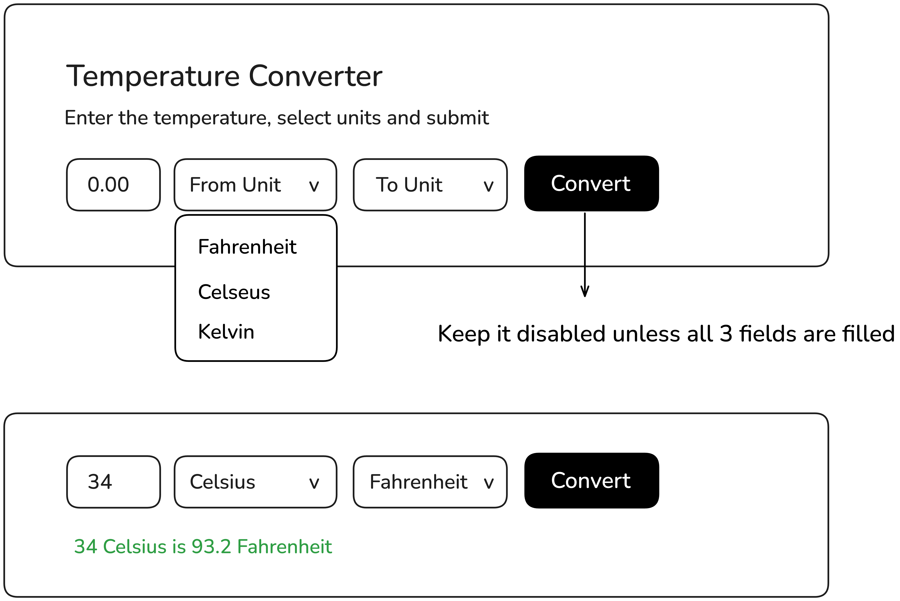

# Temperature Converter Project

This project is designed to help you practice DOM manipulation, form handling, and basic calculations in JavaScript.

## Project Overview

You will create a temperature converter that allows users to:
- Enter a temperature value
- Select the unit they want to convert from
- Select the unit they want to convert to

The “Convert” button should only be enabled when all three fields are filled in. Once the user clicks “Convert,” the tool will display the converted temperature below the form.

## Mockup

Here is a mockup of what the temperature converter might look like:

This project will help you gain experience with handling user input, conditionally enabling form elements, and performing simple calculations using JavaScript.